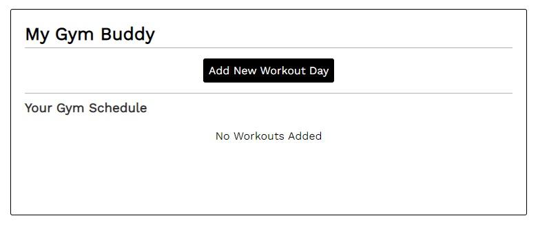
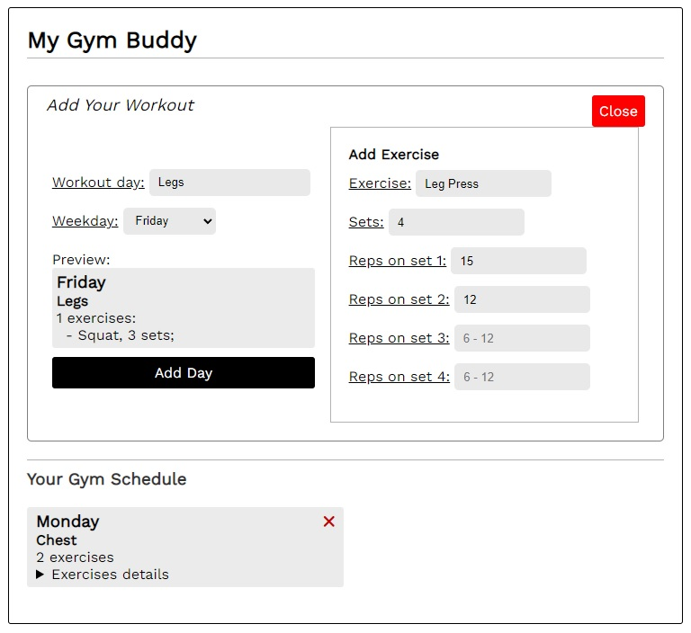

# My Gym Buddy

My Gym Buddy is a web app for schedueling your workout plan. Built with Vue.js, utilizing the local storage to store the workouts for each user.

# Initial state

# Adding your workouts
